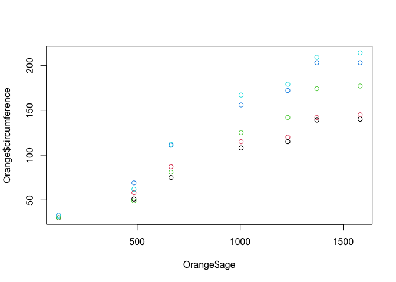
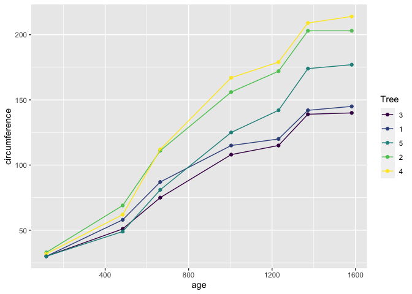
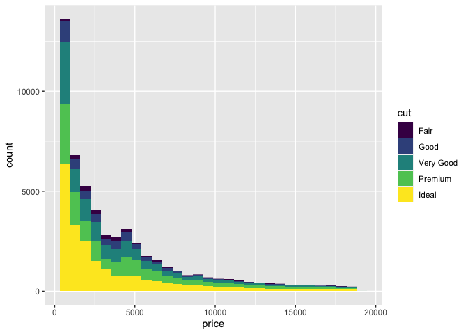
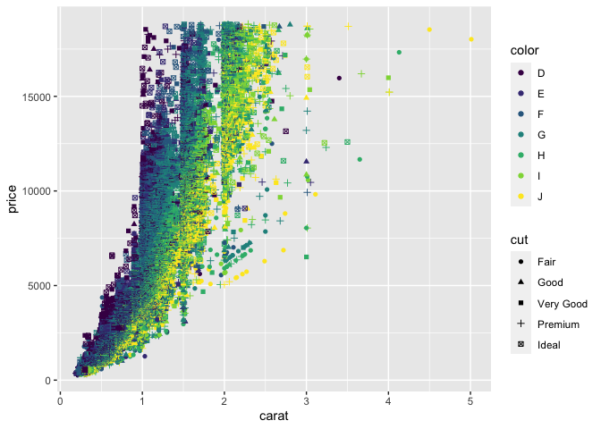

summary: Introduction to R
id: introduction-to-r
categories: r-lang
tags: tutorial
status: Draft  
authors: Tom
Feedback Link: <http://data.tjconstant.com>

# Introduction to R

## What is R?
Duration: 2

R is a programming language for statistical computing. It currently
ranks as the 12th most popular language in use today.

R’s focus is on statistics, data manipulation and visualization. It has
a flourishing, friendly community supporting it with thousands of
open-source add-ons (‘packages’) with a particular lean towards data
science and analytics.

R is free, and available from the [Comprehensive R Archive
Network](https://cran.r-project.org) (CRAN). This article will use R
version 4.1.

For developing code and managing your data science projects, I highly
recommend the open source
[RStudio](https://www.rstudio.com/products/rstudio/) which provides an
excellent integrated development environment (IDE).

If you’d like to avoid all the bother of installing R and RStudio, you
can try them both out for free on the web using [RStudio
CLoud](https://www.rstudio.com/products/cloud/), where you can program
right inside your browser.

## First Steps
Duration: 2

Within R Studio, you are provided with a console where you can type R
commands directly and then immediately see the results.

Within this console, try typing a simple sum as observe the results like
so,

``` r
1+2
```

    [1] 3

Notice R prints the correct answer `3` to the console, with a bracketed
element number `[1]`.

In R, all results are returned as vectors, which can contain multiple
values. You can **combine** multiple values into a longer vector using
the `c()` function,

``` r
c(1,2,3)
```

    [1] 1 2 3

<aside class="positive"> 
There are six basic datatypes that vectors can contain. These types are
“logical”, “integer”, “numeric”, “complex”, “character” and “raw”. R
refers to these as “Atomic” modes, since they cannot be broken down into
any more basic forms.
</aside>

## Variables
Duration: 10

### Assignment

To store a vector inside of a named variable, R uses the `<-` operator.
For example, to store the character vector `"Hello, World!"` in a
variable called `welcome`, you would type this,

``` r
welcome <- "Hello, World!"
```

<aside class="positive">  
Some people might wonder here why R uses `<-` rather than `=` like most
other programming languages do. The answer is the authors of R wanted to
emphasize that assignment (storing a value) isn’t the same as equality
(this is equal to this). It’s a small point, and after a few minutes of
coding `<-` will seem perfectly natural. Happily, if you insist on using
`=`, it’ll work just fine in **most** cases.
</aside>

To see the values stored in your `welcome` variable, you can use the
`print()` function.

``` r
print(welcome)
```

    [1] "Hello, World!"

### Element Addresses

When storing multiple values in a vector, you may wish to subset that
vector and access single or a subset of elements within it.

Lets set up a character vector called `fruit`

``` r
fruit <- c("Apple", "Pear", "Orange")

print(fruit)
```

    [1] "Apple"  "Pear"   "Orange"

To access elements within the vector, we use the `[_index]` operator. In
R, unlike in python, the index of the vector starts at `1` (Python
starts at `0`). So to access the second element you would type,

``` r
fruit[2]
```

    [1] "Pear"

### Data Frames

So far, we have just dealt with 1-dimensional vectors, but in data
science we most often deal with tabulated data (like a spreadsheet) with
rows and columns.

The `data.frame` object is the best way to create or store such tabular
data. Lets create a few more variables and also a `fruit_shop` data
frame.

``` r
fruit_colour <- c("Green", "Green", "Orange")
fruit_price <- c(0.30, 0.50, 0.75)

fruit_shop <- 
  data.frame(
    fruit_type = fruit,
    fruit_colour = fruit_colour,
    fruit_price = fruit_price
  )

print(fruit_shop)
```

      fruit_type fruit_colour fruit_price
    1      Apple        Green        0.30
    2       Pear        Green        0.50
    3     Orange       Orange        0.75

Notice R ignores white space so you’re free to break up code into
multiple lines to help readability.

To access individual elements of a 2D object such as a `data.frame`, you
can use the same operator `[]` specifying the rows and columns
`[row, column]`

``` r
fruit_shop[1,3]
```

    [1] 0.3

To choose a single column but all the rows, just omit the index for the
row,

``` r
fruit_shop[,2]
```

    [1] "Green"  "Green"  "Orange"

For a range of values, you can use the shorthand `n:m` which produces a
vector of integers from `n` to `m` inclusive,

``` r
fruit_shop[1:2,] # First two rows, all columns
```

      fruit_type fruit_colour fruit_price
    1      Apple        Green         0.3
    2       Pear        Green         0.5

<aside class="positive">  
Notice you can use `#` to indicate comments in your code. These are
useful and it’s very good practice to comment your code as you go so
someone else (or you in a few months!) remember what you were doing and
why. Comments are ignored on execution so they don’t interfere with how
the code will run.
</aside>

## Plotting Data
Duration: 10

### Base Plotting

R’s inbuilt `plot()` function can create visualizations of your data.
It’s pretty good, but you should be aware there are some far more
powerful graphing options available via packages that we’ll cover later.

Lets plot a data frame. R has some in-built data sets that are really
useful for quick experiments. Lets try plotting one of these in-built
data frames, the `Orange` data set. This data set contains observations
of several Orange trees over time, and their trunk circumference. We can
take a look by printing the Orange data set to the console.

``` r
Orange
```

       Tree  age circumference
    1     1  118            30
    2     1  484            58
    3     1  664            87
    4     1 1004           115
    5     1 1231           120
    6     1 1372           142
    7     1 1582           145
    8     2  118            33
    9     2  484            69
    10    2  664           111
    11    2 1004           156
    12    2 1231           172
    13    2 1372           203
    14    2 1582           203
    15    3  118            30
    16    3  484            51
    17    3  664            75
    18    3 1004           108
    19    3 1231           115
    20    3 1372           139
    21    3 1582           140
    22    4  118            32
    23    4  484            62
    24    4  664           112
    25    4 1004           167
    26    4 1231           179
    27    4 1372           209
    28    4 1582           214
    29    5  118            30
    30    5  484            49
    31    5  664            81
    32    5 1004           125
    33    5 1231           142
    34    5 1372           174
    35    5 1582           177

We see this data frame has three columns, a `Tree` id that identifies
which tree, the `age` of the tree (in days), and the tree’s
`circumfrance`. Tosee information on the data set, or indeed any
function, you can quickly bring up the help by typing `?Orange`.

Lets plot this data frame so see the relationship between age and
circumfrance. For this we’ll select column 2 for the x-axis and column 3
for the y axis.

``` r
plot(Orange[,2], Orange[,3])
```

 Not a bad start, but we can do
better. Firstly, lets make our code more readable by using a different
way of selecting columns.

For data frames, we can use the `$` operator to refer to a column by
it’s name, rather than it’s index.

``` r
plot(Orange$age, Orange$circumference)
```


Ok, not much change to the graph, except the axis labels are a little
more helpful. Now, lets colour the points by the tree which the
observation came from. We do this by passing the `col =` parameter to
the `plot()` function.

``` r
plot(Orange$age, Orange$circumference, col = Orange$Tree)
```



There are lots of other base plotting functions in R, such as
`barplot()`, `boxplot()` and `hist()`. However, the majority of data
scientists forego the base plotting in favor of an open source
alternative called ‘ggplot’.

### ggplot

The `ggplot` package stands for the **g**rammar of **g**raphics plots.
It’s design is based on a book by Leland Wilkinson called,
unsurprisingly, [The Grammar of
Graphics](https://www.amazon.com/Grammar-Graphics-Statistics-Computing/dp/0387245448/ref=as_li_ss_tl).
It was created by [Hadley Wickham](http://hadley.nz), who is now the
chief data scientist as RStudio, and is one of the R community’s most
prolific contributors.

<aside class="positive"> 
The [ggplot website](https://ggplot2.tidyverse.org) is a fantasitc
source of how to use the package with very clear documentation and
examples.
</aside>

To use a package, we must first install it. To install packages into R,
you use the `install_packages()` function.

``` r
install.packages("ggplot2")
```

We then need to load a package into our R session, which we do like so,

``` r
library(ggplot2)
```

Lets explore how ggplot works. The philosophy of ggplot is that a plot
is made of elements that should be separately controlled. We have things
like the scales on the axis, the geometries we use to represent the data
(such as points for scatter plots, lines for trends or bars for
barcharts),

Lets start by plotting our Oranges,

``` r
library(ggplot2)

ggplot(data = Orange, mapping = aes(x = age, y = circumference, colour = Tree)) +
  geom_point() +
  geom_line()
```



Lets break down this bit of code.

-   In the first line of this call, the first argument we pass to
    `ggplot()` is always the data, the second argument wrapped in the
    `aes()` function are called the aesthetics, which define how the
    data is mapped to elements of the chart.
-   We’ve mapped here the `x` values to `age`, the `y` values to
    `circumference`, and the `colour` values to the `Tree`. (The
    american spelling `color=` is also acceptable).
-   In the subsequent lines, we have added using the `+` operator
    different geometries to represent our data, such as points and
    lines. These points and lines inherit the aesthetics, so they know
    what x, y, and colour values they should be using to be consistent
    with the data.

<aside class="positive">   
It’s also worth noting that when we passed the variables to the `aes()`
function, we did so without quoting them (`age` instead of `"age"`). For
people coming from other programming languages this quirk of R can be
quite shocking. How does R know that `age` is a label and not a
variable? What happens if I have a variable `age <- "Tree"`? This comes
down to a feature of R known as lazy evaluation. R doesn’t attempt to
execute or read a variable until it absolutely has too. Programmers like
Hadley Wickham have used this property of R extensively in their
packages to make code more human-readable and friendly.
</aside>

ggplot is far more powerful that base graphics when plotting complex
charts thanks to this simple separation between the data and the chart
elements.

Lets try a more complex examples using the example data set from ggplot,
`diamonds`.

``` r
ggplot(
  data = diamonds,
  mapping = aes(
    x = price,
    fill = cut
  ) 
) +
  geom_histogram()
```

    `stat_bin()` using `bins = 30`. Pick better value with `binwidth`.



In this example, we mapped the price of a set of diamonds to x, and the
fill colour to the quality of the diamond’s cut. We then added a
histogram geometry to get the resulting histogram plot.

Lets try mapping other aesthetics,

``` r
ggplot(
  data = diamonds,
  mapping = aes(x = carat, y = price, color = color, shape = cut)
  ) +
  geom_point()
```

    Warning: Using shapes for an ordinal variable is not advised



Here we’ve mapped `x`, `y`, `shape`, `colour` and the quality of `cut`
to various aesthetics that have then been used in the `geom_point()`
geometry.

Lets just quickly this plot up by adding labels and a theme

``` r
ggplot(
  data = diamonds,
  mapping = aes(x = carat, y = price, color = color, shape = cut)
  ) +
  geom_point() +
  labs(
    title = "The Diamonds Dataset",
    subtitle = "An Example Plot for Intro to R",
  ) +
  theme_light()
```

    Warning: Using shapes for an ordinal variable is not advised


