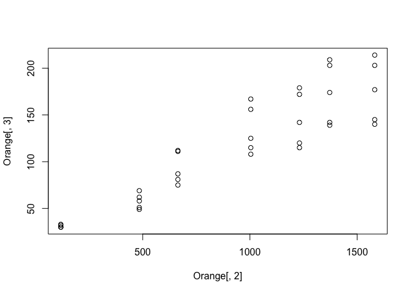
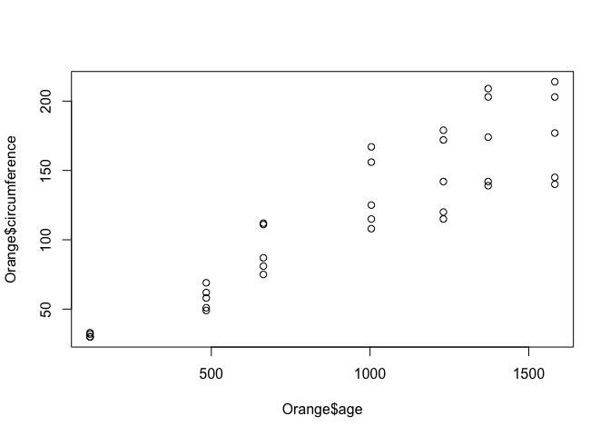
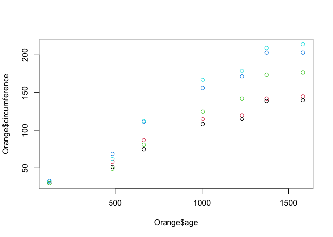
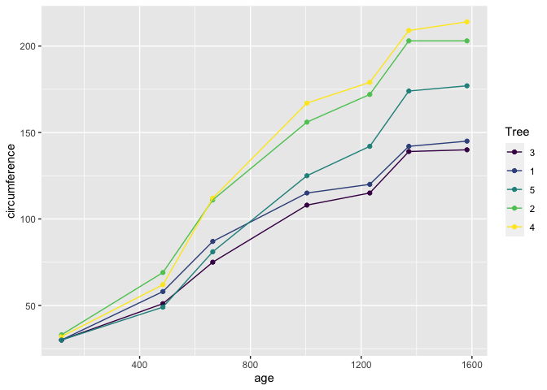
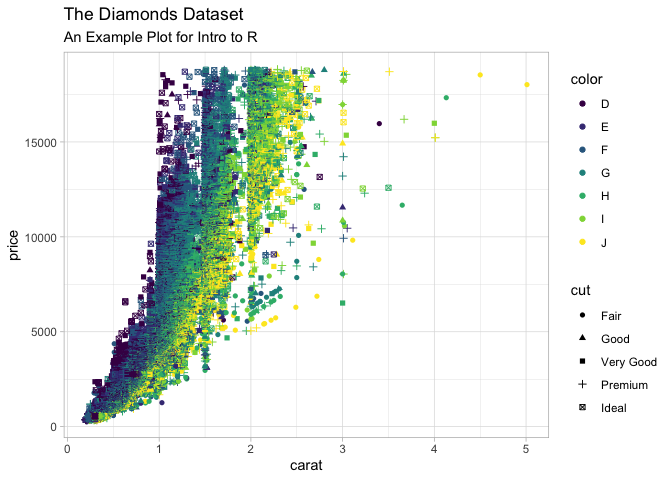

summary: Introduction to R
id: introduction-to-r
categories: r-lang
tags: tutorial
status: Published
authors: Tom
Feedback Link: <http://data.tjconstant.com>

# Introduction to R

## What is R?

Duration: 2

R is a programming language for statistical computing. It currently
ranks as the 12th most popular language in use today.

R’s focus is on statistics, data manipulation and visualization. It has
a flourishing, friendly community supporting it with thousands of
open-source add-ons (‘packages’) with a particular lean towards data
science and analytics.

R is free, and available from the [Comprehensive R Archive
Network](https://cran.r-project.org) (CRAN). This article will use R
version 4.1.

For developing code and managing your data science projects, I highly
recommend the open source
[RStudio](https://www.rstudio.com/products/rstudio/) which provides an
excellent integrated development environment (IDE).

If you’d like to avoid all the bother of installing R and RStudio, you
can try them both out for free on the web using [RStudio
CLoud](https://www.rstudio.com/products/cloud/), where you can program
right inside your browser.

## First Steps

Duration: 2

Within R Studio, you are provided with a console where you can type R
commands directly and then see the results.

Within this console, try typing a simple sum and observe the results
like so,

``` r
1+2
```

    [1] 3

Notice R prints the correct answer `3` to the console, with a bracketed
element number `[1]`.

In R, all results are returned as vectors, which can contain multiple
values. You can **combine** multiple values into a longer vector using
the `c()` function,

``` r
c(1,2,3)
```

    [1] 1 2 3

<aside class="positive">
There are six basic datatypes that vectors can contain. These types are
“logical”, “integer”, “numeric”, “complex”, “character” and “raw”. R
refers to these as “Atomic” modes, since they cannot be broken down into
any more basic forms.
</aside>

## Variables

Duration: 10

### Assignment

To store a vector inside of a named variable, R uses the `<-` operator.
For example, to store the character vector `"Hello, World!"` in a
variable called `welcome`, you would type this,

``` r
welcome <- "Hello, World!"
```

<aside class="positive">
Some people might wonder here why R uses `<-` rather than `=` like most
other programming languages do. The answer is the authors of R wanted to
emphasize that assignment (storing a value) isn’t the same as equality
(this is equal to this). It’s a small point, and after a few minutes of
coding `<-` will seem perfectly natural. Happily, if you insist on using
`=`, it’ll work just fine in most cases.
</aside>

To see the values stored in your `welcome` variable, you can use the
`print()` function.

``` r
print(welcome)
```

    [1] "Hello, World!"

### Element Addresses

When storing multiple values in a vector, you may wish to subset that
vector and access single or a subset of elements within it.

Lets set up a character vector called `fruit`

``` r
fruit <- c("Apple", "Pear", "Orange")

print(fruit)
```

    [1] "Apple"  "Pear"   "Orange"

To access elements within the vector, we use the `[_index]` operator. In
R, unlike in python, the index of the vector starts at `1` (Python
starts at `0`). So to access the second element you would type,

``` r
fruit[2]
```

    [1] "Pear"

### Data Frames

So far, we have just dealt with 1-dimensional vectors, but in data
science we most often deal with tabulated data (like a spreadsheet) with
rows and columns.

The `data.frame` object is the best way to create or store such tabular
data. Lets create a few more variables and also a `fruit_shop` data
frame.

``` r
fruit_colour <- c("Green", "Green", "Orange")
fruit_price <- c(0.30, 0.50, 0.75)

fruit_shop <- 
  data.frame(
    fruit_type = fruit,
    fruit_colour = fruit_colour,
    fruit_price = fruit_price
  )

print(fruit_shop)
```

      fruit_type fruit_colour fruit_price
    1      Apple        Green        0.30
    2       Pear        Green        0.50
    3     Orange       Orange        0.75

Notice R ignores white space so you’re free to break up code into
multiple lines to help readability.

To access individual elements of a 2D object such as a `data.frame`, you
can use the same operator `[]` specifying the rows and columns
`[row, column]`

``` r
fruit_shop[1,3]
```

    [1] 0.3

To choose a single column but all the rows, just omit the index for the
row,

``` r
fruit_shop[,2]
```

    [1] "Green"  "Green"  "Orange"

For a range of values, you can use the shorthand `n:m` which produces a
vector of integers from `n` to `m` inclusive,

``` r
fruit_shop[1:2,] # First two rows, all columns
```

      fruit_type fruit_colour fruit_price
    1      Apple        Green         0.3
    2       Pear        Green         0.5

<aside class="positive">
Notice you can use `#` to indicate comments in your code. These are
useful and it’s very good practice to comment your code as you go so
someone else (or you in a few months!) remember what you were doing and
why. Comments are ignored on execution so they don’t interfere with how
the code will run.
</aside>

## Data Wrangling

Duration: 15

Data wrangling in R is the process of importing, analyzing, cleaning and
summarizing data. In this section we will take a look at a sample
dataset contaning aircraft flights from NYC.

For this section you will need to install the `nycflights13` package,
which contains the data, and the `dplyr` package for data manipulation.

You can install both these packages with the following command,

``` r
install.packages(c("dplyr", "nycflights13"))
```

We will the load these packages into our R session


    Attaching package: 'dplyr'

    The following objects are masked from 'package:stats':

        filter, lag

    The following objects are masked from 'package:base':

        intersect, setdiff, setequal, union

And we can take a look at the flights data by printing it to the console

``` r
print(flights)
```

    # A tibble: 336,776 x 19
        year month   day dep_time sched_dep_time dep_delay arr_time sched_arr_time
       <int> <int> <int>    <int>          <int>     <dbl>    <int>          <int>
     1  2013     1     1      517            515         2      830            819
     2  2013     1     1      533            529         4      850            830
     3  2013     1     1      542            540         2      923            850
     4  2013     1     1      544            545        -1     1004           1022
     5  2013     1     1      554            600        -6      812            837
     6  2013     1     1      554            558        -4      740            728
     7  2013     1     1      555            600        -5      913            854
     8  2013     1     1      557            600        -3      709            723
     9  2013     1     1      557            600        -3      838            846
    10  2013     1     1      558            600        -2      753            745
    # … with 336,766 more rows, and 11 more variables: arr_delay <dbl>,
    #   carrier <chr>, flight <int>, tailnum <chr>, origin <chr>, dest <chr>,
    #   air_time <dbl>, distance <dbl>, hour <dbl>, minute <dbl>, time_hour <dttm>

Although `flights` is a type of data frame, the output to the console is
much neater than normal. This is because `flights` is actually a type of
data frame called a `tibble`. The distinction doesn’t make any practical
difference to our analysis, for our needs it just prints tidier output
to the console.

### Selecting and Filtering

With `dplyr`, we can select a subset of columns using the `select`
function. Lets select the month and the year from the dataset like so,

``` r
select(.data = flights, month, year)
```

    # A tibble: 336,776 x 2
       month  year
       <int> <int>
     1     1  2013
     2     1  2013
     3     1  2013
     4     1  2013
     5     1  2013
     6     1  2013
     7     1  2013
     8     1  2013
     9     1  2013
    10     1  2013
    # … with 336,766 more rows

We can also use `dplyr`s `filter()` function to filter the results to
some logcial condition. For example, we can filter to only flights in
January like so,

``` r
filter(.data = flights, month == 1)
```

    # A tibble: 27,004 x 19
        year month   day dep_time sched_dep_time dep_delay arr_time sched_arr_time
       <int> <int> <int>    <int>          <int>     <dbl>    <int>          <int>
     1  2013     1     1      517            515         2      830            819
     2  2013     1     1      533            529         4      850            830
     3  2013     1     1      542            540         2      923            850
     4  2013     1     1      544            545        -1     1004           1022
     5  2013     1     1      554            600        -6      812            837
     6  2013     1     1      554            558        -4      740            728
     7  2013     1     1      555            600        -5      913            854
     8  2013     1     1      557            600        -3      709            723
     9  2013     1     1      557            600        -3      838            846
    10  2013     1     1      558            600        -2      753            745
    # … with 26,994 more rows, and 11 more variables: arr_delay <dbl>,
    #   carrier <chr>, flight <int>, tailnum <chr>, origin <chr>, dest <chr>,
    #   air_time <dbl>, distance <dbl>, hour <dbl>, minute <dbl>, time_hour <dttm>

<aside class="positive">

Notice when we passed the variables to the `select()` and `filter()`
functions, we did so without quoting them (`month` instead of
`"month"`).

For people coming from other programming languages this quirk of R can
be quite shocking. How does R know that `month` is a label and not a
variable? or a function?

This comes down to a feature of R known as lazy evaluation. R doesn’t
attempt to execute or read a variable until it absolutely has too.
Programmers like Hadley Wickham have used this property of R extensively
in their packages to make code more human-readable and friendly.
</aside>

### Pipes

Say we wanted to combine the last two steps to both selecitng only a few
columns and then filtering. TO achieve this, we could write,

``` r
filter(select(.data = flights, month, year), month == 1)
```

    # A tibble: 27,004 x 2
       month  year
       <int> <int>
     1     1  2013
     2     1  2013
     3     1  2013
     4     1  2013
     5     1  2013
     6     1  2013
     7     1  2013
     8     1  2013
     9     1  2013
    10     1  2013
    # … with 26,994 more rows

However, you can see that this isn’t very human-readable. It’s not too
clear what exactly is happening, or what steps are performed in what
order. You can imagine with complex data wrangling, this way of writing
code will soon become unreadable and hard to maintain.

This is where the pipe operator (`%>%`) comes in handy. The pipe takes
the result of the expression on the left hand side and passes it as the
first argument to the right hand side. So the same set of calls becomes,

``` r
flights %>%
  select(month, year) %>%
  filter(month == 1)
```

    # A tibble: 27,004 x 2
       month  year
       <int> <int>
     1     1  2013
     2     1  2013
     3     1  2013
     4     1  2013
     5     1  2013
     6     1  2013
     7     1  2013
     8     1  2013
     9     1  2013
    10     1  2013
    # … with 26,994 more rows

Here we take `flights` and pipe it to the `select()` function. The first
argument for select is `.data =` so flights is passed as this parameter.
Within `dplyr`, all the data functions accept `.data =` first, so the
pipe is extremely powerful to chain commands together.

### Mutate

To mutate a data.frame is to change it by adding an additional column.
The data for this new column can be a new vector, or it can be some
calculation / operation on existing columns.

Lets add a column called `distance_km` than converts the `distance`
column (in miles) to a distance in kilometers,

``` r
flights %>% 
  select(carrier, distance) %>% 
  mutate(distance_km = 1.61 * distance)
```

    # A tibble: 336,776 x 3
       carrier distance distance_km
       <chr>      <dbl>       <dbl>
     1 UA          1400       2254 
     2 UA          1416       2280.
     3 AA          1089       1753.
     4 B6          1576       2537.
     5 DL           762       1227.
     6 UA           719       1158.
     7 B6          1065       1715.
     8 EV           229        369.
     9 B6           944       1520.
    10 AA           733       1180.
    # … with 336,766 more rows

### Summarise

We may also want to summarise data by performing some aggregations on
the data. For this, we use the `summarise()` function.

``` r
flights %>% 
  select(carrier, distance) %>% 
  mutate(distance_km = 1.61 * distance) %>% 
  summarise(avg_distance = mean(distance_km))
```

    # A tibble: 1 x 1
      avg_distance
             <dbl>
    1        1674.

In this case, we summarise all the rows to find the mean distance in
kilometers for the whole dataset.

### Groups

So far, we have selected, filtered and summarised the `flights` dataset
as a whole. However, we may wish to perform these operations on groups
of data within the dataset.

For example, what is the average distance per company? `dplyr` lets you
group the dataset based on one or more of it’s columns, and then all
subsequent ooperations will be done group-by-group.

As an example, lets get the mean distance per carrier,

``` r
flights %>% 
  select(carrier, distance) %>% 
  mutate(distance_km = 1.61 * distance) %>% 
  group_by(carrier) %>% 
  summarise(avg_distance = mean(distance_km))
```

    # A tibble: 16 x 2
       carrier avg_distance
       <chr>          <dbl>
     1 9E              854.
     2 AA             2158.
     3 AS             3867.
     4 B6             1720.
     5 DL             1991.
     6 EV              906.
     7 F9             2608.
     8 FL             1070.
     9 HA             8023.
    10 MQ              917.
    11 OO              806.
    12 UA             2462.
    13 US              891.
    14 VX             4024.
    15 WN             1604.
    16 YV              604.

## Plotting Data

Duration: 10

### Base Plotting

R’s inbuilt `plot()` function can create visualizations of your data.
It’s pretty good, but you should be aware there are some far more
powerful graphing options available via packages that we’ll cover later.

Lets plot a data frame. R has some in-built data sets that are really
useful for quick experiments. Lets try plotting one of these in-built
data frames, the `Orange` data set. This data set contains observations
of several Orange trees over time, and their trunk circumference. We can
take a look by printing the Orange data set to the console.

``` r
Orange
```

       Tree  age circumference
    1     1  118            30
    2     1  484            58
    3     1  664            87
    4     1 1004           115
    5     1 1231           120
    6     1 1372           142
    7     1 1582           145
    8     2  118            33
    9     2  484            69
    10    2  664           111
    11    2 1004           156
    12    2 1231           172
    13    2 1372           203
    14    2 1582           203
    15    3  118            30
    16    3  484            51
    17    3  664            75
    18    3 1004           108
    19    3 1231           115
    20    3 1372           139
    21    3 1582           140
    22    4  118            32
    23    4  484            62
    24    4  664           112
    25    4 1004           167
    26    4 1231           179
    27    4 1372           209
    28    4 1582           214
    29    5  118            30
    30    5  484            49
    31    5  664            81
    32    5 1004           125
    33    5 1231           142
    34    5 1372           174
    35    5 1582           177

We see this data frame has three columns, a `Tree` id that identifies
which tree, the `age` of the tree (in days), and the tree’s
`circumfrance`. Tosee information on the data set, or indeed any
function, you can quickly bring up the help by typing `?Orange`.

Lets plot this data frame so see the relationship between age and
circumfrance. For this we’ll select column 2 for the x-axis and column 3
for the y axis.

``` r
plot(Orange[,2], Orange[,3])
```



Not a bad start, but we can do better. Firstly, lets make our code more
readable by using a different way of selecting columns.

For data frames, we can use the `$` operator to refer to a column by
it’s name, rather than it’s index.

``` r
plot(Orange$age, Orange$circumference)
```



Ok, not much change to the graph, except the axis labels are a little
more helpful. Now, lets colour the points by the tree which the
observation came from. We do this by passing the `col =` parameter to
the `plot()` function.

``` r
plot(Orange$age, Orange$circumference, col = Orange$Tree)
```



There are lots of other base plotting functions in R, such as
`barplot()`, `boxplot()` and `hist()`. However, the majority of data
scientists forego the base plotting in favor of an open source
alternative called ‘ggplot’.

### ggplot

The `ggplot` package stands for the **g**rammar of **g**raphics plots.
It’s design is based on a book by Leland Wilkinson called,
unsurprisingly, [The Grammar of
Graphics](https://www.amazon.com/Grammar-Graphics-Statistics-Computing/dp/0387245448/ref=as_li_ss_tl).
It was created by [Hadley Wickham](http://hadley.nz), who is now the
chief data scientist as RStudio, and is one of the R community’s most
prolific contributors.

<aside class="positive">
The ggplot website (<https://ggplot2.tidyverse.org>) is a fantastic
source of how to use the package with very clear documentation and
examples.
</aside>

To use a package, we must first install it. To install packages into R,
you use the `install_packages()` function.

``` r
install.packages("ggplot2")
```

We then need to load a package into our R session, which we do like so,

``` r
library(ggplot2)
```

Lets explore how ggplot works. The philosophy of ggplot is that a plot
is made of elements that should be separately controlled. We have things
like the scales on the axis, the geometries we use to represent the data
(such as points for scatter plots, lines for trends or bars for
barcharts),

Lets start by plotting our Oranges,

``` r
library(ggplot2)

ggplot(data = Orange, mapping = aes(x = age, y = circumference, colour = Tree)) +
  geom_point() +
  geom_line()
```



Lets break down this bit of code.

-   In the first line of this call, the first argument we pass to
    `ggplot()` is always the data, the second argument wrapped in the
    `aes()` function are called the aesthetics, which define how the
    data is mapped to elements of the chart.
-   We’ve mapped here the `x` values to `age`, the `y` values to
    `circumference`, and the `colour` values to the `Tree`. (The
    american spelling `color=` is also acceptable).
-   In the subsequent lines, we have added using the `+` operator
    different geometries to represent our data, such as points and
    lines. These points and lines inherit the aesthetics, so they know
    what x, y, and colour values they should be using to be consistent
    with the data.

<aside class="positive">
It’s also worth noting that when we passed the variables to the `aes()`
function, we did so without quoting them (`age` instead of `"age"`). For
people coming from other programming languages this quirk of R can be
quite shocking. How does R know that `age` is a label and not a
variable? What happens if I have a variable `age <- "Tree"`? This comes
down to a feature of R known as lazy evaluation. R doesn’t attempt to
execute or read a variable until it absolutely has too. Programmers like
Hadley Wickham have used this property of R extensively in their
packages to make code more human-readable and friendly.
</aside>

ggplot is far more powerful that base graphics when plotting complex
charts thanks to this simple separation between the data and the chart
elements.

Lets try a more complex examples using the example data set from ggplot,
`diamonds`.

``` r
ggplot(
  data = diamonds,
  mapping = aes(
    x = price,
    fill = cut
  ) 
) +
  geom_histogram()
```

    `stat_bin()` using `bins = 30`. Pick better value with `binwidth`.


In this example, we mapped the price of a set of diamonds to x, and the
fill colour to the quality of the diamond’s cut. We then added a
histogram geometry to get the resulting histogram plot.

Lets try mapping other aesthetics,

``` r
ggplot(
  data = diamonds,
  mapping = aes(x = carat, y = price, color = color, shape = cut)
  ) +
  geom_point()
```

    Warning: Using shapes for an ordinal variable is not advised


Here we’ve mapped `x`, `y`, `shape`, `colour` and the quality of `cut`
to various aesthetics that have then been used in the `geom_point()`
geometry.

Lets just quickly this plot up by adding labels and a theme

``` r
ggplot(
  data = diamonds,
  mapping = aes(x = carat, y = price, color = color, shape = cut)
  ) +
  geom_point() +
  labs(
    title = "The Diamonds Dataset",
    subtitle = "An Example Plot for Intro to R",
  ) +
  theme_light()
```

    Warning: Using shapes for an ordinal variable is not advised



## Machine Learning

In this section we are going to demonstrate the machine learning
capabilities of R using the `tidymodels` package.

The `tidymodels` package is relatively new, and is a ‘meta package’ that
wraps up lots of machine learning packages with a common API.

This makes switching between models and methods really easy, even if the
underlying packages they are based on behave very differently. Most of
this functionality is actually provided by a `tidymodels` package,
`parsnip`.

### Get the Data

Duration 15

For this simple example to demonstrate the power of ML in R, I have
prepared and pre-processed some data for us. We will be using a
prepossessed version of the
[`palmerpenguins`](https://allisonhorst.github.io/palmerpenguins/)
dataset.

The pre-processed versions we will be using can be downloaded from
gitlab. There are two files, one for analysis/training the model, and
one file of independent observations for assessment/testing the model.

-   [Download Analysis
    Dataset](https://raw.githubusercontent.com/tjconstant/penguins/main/penguins_analysis.csv)
-   [Download Assessment
    Dataset](https://raw.githubusercontent.com/tjconstant/penguins/main/penguins_assessment.csv)

Alternatively, and encouraged, you can load these files directly into R
using their URLS like so

``` r
library(readr)

df_analysis <-
  read_csv("https://raw.githubusercontent.com/tjconstant/penguins/main/penguins_analysis.csv") %>%
  mutate(species = as.factor(species))
```

    Rows: 258 Columns: 8

    ── Column specification ────────────────────────────────────────────────────────
    Delimiter: ","
    chr (3): island, sex, species
    dbl (5): bill_length_mm, bill_depth_mm, flipper_length_mm, body_mass_g, year


    ℹ Use `spec()` to retrieve the full column specification for this data.
    ℹ Specify the column types or set `show_col_types = FALSE` to quiet this message.

``` r
df_assesment <-
  read_csv("https://raw.githubusercontent.com/tjconstant/penguins/main/penguins_assessment.csv") %>%
  mutate(species = as.factor(species))
```

    Rows: 86 Columns: 8

    ── Column specification ────────────────────────────────────────────────────────
    Delimiter: ","
    chr (3): island, sex, species
    dbl (5): bill_length_mm, bill_depth_mm, flipper_length_mm, body_mass_g, year


    ℹ Use `spec()` to retrieve the full column specification for this data.
    ℹ Specify the column types or set `show_col_types = FALSE` to quiet this message.

We have also changed the `species` column type to a `factor` rather than
a character. Factors are useful for categorical types of data and is
expected by most of `tidymodels` functions.

### Choosing a Classifier

For starters, we are going to use a Decision Tree classifier to attempt
to predict the species of the penguins based on the other variables.

To set up a classifier we will create a model object like this,

``` r
library(tidymodels, quietly = TRUE)
```

    Registered S3 method overwritten by 'tune':
      method                   from   
      required_pkgs.model_spec parsnip

    ── Attaching packages ────────────────────────────────────── tidymodels 0.1.3 ──

    ✓ broom        0.7.8      ✓ rsample      0.1.0 
    ✓ dials        0.0.9      ✓ tibble       3.1.2 
    ✓ infer        0.5.4      ✓ tidyr        1.1.3 
    ✓ modeldata    0.1.1      ✓ tune         0.1.6 
    ✓ parsnip      0.1.7      ✓ workflows    0.2.3 
    ✓ purrr        0.3.4      ✓ workflowsets 0.1.0 
    ✓ recipes      0.1.16     ✓ yardstick    0.0.8 

    ── Conflicts ───────────────────────────────────────── tidymodels_conflicts() ──
    x purrr::discard()  masks scales::discard()
    x dplyr::filter()   masks stats::filter()
    x dplyr::lag()      masks stats::lag()
    x yardstick::spec() masks readr::spec()
    x recipes::step()   masks stats::step()
    • Use tidymodels_prefer() to resolve common conflicts.

``` r
classifier <- 
  decision_tree(mode = "classification") %>%
  set_engine("rpart")
```

Note you may need to install `rpart` package for using the decision tree
example above.

### Fitting the Model

To fit the model, we call the fit command.

``` r
model <- fit(classifier, formula = species ~ ., data = df_analysis)
```

We specify the classifier (The Decision Tree). We also provide a formula
telling the fit function what we are predicting and what to use as
predictors. For this formula we specify the `species` column as the
output, and use the shorthand `species ~ .` to indicate that everything
else should be used as the predictors.

If we wanted to try and predict the species based solely on `island` and
`sex` (a poor idea!), we would instead write `species ~ island + sex`.

### Evaluate the model

We now assess the model based on data it has not previously seen, and
deduce the accuracy of our model.

For this, we use our trained model to predict the species from the
`df_assessment` data frame.

``` r
df_pred <- predict(model, new_data = df_assesment)

df_pred
```

    # A tibble: 86 x 1
       .pred_class
       <fct>      
     1 Adelie     
     2 Adelie     
     3 Chinstrap  
     4 Adelie     
     5 Adelie     
     6 Adelie     
     7 Adelie     
     8 Adelie     
     9 Adelie     
    10 Adelie     
    # … with 76 more rows

Notice only the predictions are returned in a single column names
`.pred_class`. It will be more useful to have the original
`df_assessment` appended, so instead we can bind the columns together
using `bind_cols`.

``` r
df_pred <-
  df_assesment %>% 
  bind_cols(
    predict(model, new_data = df_assesment)
  )
  
df_pred
```

    # A tibble: 86 x 9
       island  bill_length_mm bill_depth_mm flipper_length_… body_mass_g sex    year
       <chr>            <dbl>         <dbl>            <dbl>       <dbl> <chr> <dbl>
     1 Torger…           40.3          18                195        3250 fema…  2007
     2 Torger…           36.6          17.8              185        3700 fema…  2007
     3 Torger…           46            21.5              194        4200 male   2007
     4 Biscoe            35.9          19.2              189        3800 fema…  2007
     5 Biscoe            38.2          18.1              185        3950 male   2007
     6 Biscoe            40.6          18.6              183        3550 male   2007
     7 Dream             37.2          18.1              178        3900 male   2007
     8 Dream             39.8          19.1              184        4650 male   2007
     9 Dream             37            16.9              185        3000 fema…  2007
    10 Dream             39.6          18.8              190        4600 male   2007
    # … with 76 more rows, and 2 more variables: species <fct>, .pred_class <fct>

To test the accuracy of this model, we can pass the resulting data frame
to `accuracy`.

``` r
df_pred %>% 
  accuracy(truth = species, estimate = .pred_class)
```

    # A tibble: 1 x 3
      .metric  .estimator .estimate
      <chr>    <chr>          <dbl>
    1 accuracy multiclass     0.953

Abut 95% accuracy! Not bad!

### Improving the model

One of the great things about `tidymodels` (and under the hood
`parsnip`), is the method of building the model is the same whichever
model we try an run.

For example, instead of a decision tree, why don’t we try a Random
Forest?

The following code chunk is identical to the commands above, except for
the `classifer <-` line. We also need to install the Random Forest
library `ranger` before running this code.

``` r
classifier <- 
  rand_forest(mode = "classification") %>%
  set_engine("ranger")

model <- fit(classifier, formula = species ~ ., data = df_analysis)

df_pred <-
  df_assesment %>% 
  bind_cols(
    predict(model, new_data = df_assesment)
  )

df_pred %>% 
  accuracy(truth = species, estimate = .pred_class)
```

    # A tibble: 1 x 3
      .metric  .estimator .estimate
      <chr>    <chr>          <dbl>
    1 accuracy multiclass     0.988

98%! Very good. Lastly (since it’s so easy!), lets tre a Gradient
Boosted tree. Again, this code is identical except for the classifier.
For this classifier you need to install the `xgboost` library.

``` r
classifier <- 
  boost_tree(mode = "classification") %>%
  set_engine("xgboost")

model <- fit(classifier, formula = species ~ ., data = df_analysis)
```

    [11:26:43] WARNING: amalgamation/../src/learner.cc:1095: Starting in XGBoost 1.3.0, the default evaluation metric used with the objective 'multi:softprob' was changed from 'merror' to 'mlogloss'. Explicitly set eval_metric if you'd like to restore the old behavior.

``` r
df_pred <-
  df_assesment %>% 
  bind_cols(
    predict(model, new_data = df_assesment)
  )

df_pred %>% 
  accuracy(truth = species, estimate = .pred_class)
```

    # A tibble: 1 x 3
      .metric  .estimator .estimate
      <chr>    <chr>          <dbl>
    1 accuracy multiclass         1

100%!!!

OK, so any Data Scientist should be wary of perfect accuracy, and we
should thoroughly check these models using techniques like
cross-validation. But hopefully this gives you an idea of the power of
`tidymodels` and `parsnip`.

There is lots of other features of `tidymodels` I haven’t covered here
like pre-processing using the `recipies` packages, building ML pipelines
using `workflow`, Auto ML type analysis using `workflowsets` and all the
different sampling and cross-validation techniques. But common to all
these packages that are part of `tidymodels` is they follow a common API
structure and can be swapped in and out with little changes to your
code.
